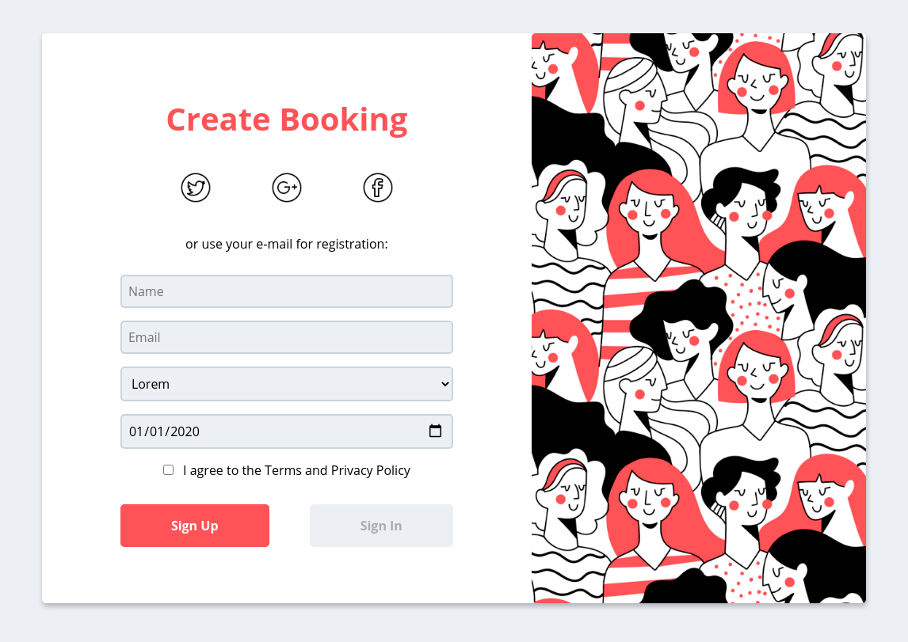

<h3 align="center">
    <b>Form mockup with pure HTML, JS & CSS</b> 
</h3>

## :computer: Web

<h1 align="center">
    
</h1>

## :bookmark: About

This is a small mockup for a pure HTML and JS form, using cookies to save the information and with a qrcode option using google chart api.

## :mailbox_with_mail: Get in touch!

&nbsp;&nbsp;&nbsp;
&nbsp;&nbsp;&nbsp;
 